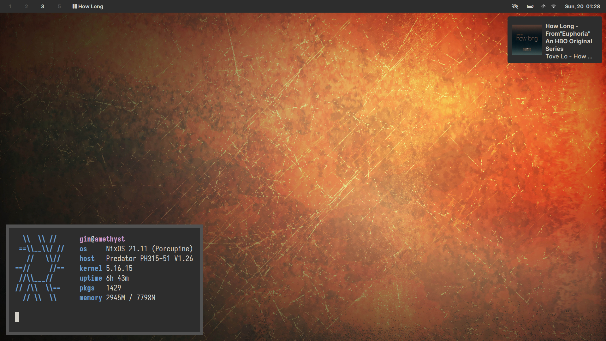

### Welcome traveller to the disarray that are my dotfiles!

|                     |                                                                                                               |
| ------------------- | ------------------------------------------------------------------------------------------------------------- |
| OS                  | [NixOS 21.11](https://nixos.org/)                                                                             |
| Window Manager      | [Sway](https://github.com/swaywm/sway/) [i3-gaps](https://github.com/Airblader/i3)                            |
| GTK Theme           | [Materia Nix-colors](https://github.com/Misterio77/nix-colors)                                                |
| Icon Theme          | [Papirus](https://github.com/PapirusDevelopmentTeam/papirus-icon-theme)                                       |
| Cusor Theme         | [Capitaine Cursors](https://github.com/keeferrourke/capitaine-cursors)                                        |
| UI Font             | [Inter](https://github.com/rsms/inter)                                                                        | 
| Terminal            | [Foot](https://codeberg.org/dnkl/foot) [Alacritty](https://github.com/alacritty/alacritty)                    |
| Terminal Font       | [Iosevka](https://github.com/be5invis/Iosevka)                                                                |
| PDF Viewer          | [Zathura](https://git.pwmt.org/pwmt/zathura)                                                                  |
| Editor              | [Neovim](https://neovim.io/)                                                                                  |
| Shell               | [Zsh](https://www.zsh.org/)                                                                                   |
| Wallpaper           | [By Eberhard Grossgasteiger](./assets/wallpaper.png)                                                          |
| Colorscheme         | eighties                                                                                    |

# Color Palette
|                                                                           |                                                                                              |
|---------------------------------------------------------------------------|----------------------------------------------------------------------------------------------|
|  `#2d2d2d` |  `#f2777a`  |
|  `#393939` |  `#f99157`  |
|  `#515151` |  `#ffcc66`  |
|  `#747369` |  `#99cc99`  |
|  `#a09f93` |  `#66cccc`  |
|  `#d3d0c8` |  `#6699cc`  |
|  `#e8e6df` |  `#cc99cc`  |
|  `#f2f0ec` |  `#d27b53`  |
