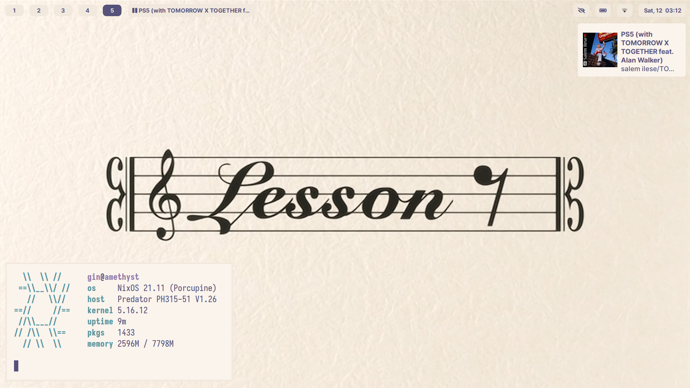

### Welcome traveller to the disarray that are my dotfiles!

|                     |                                                                                                               |
| ------------------- | ------------------------------------------------------------------------------------------------------------- |
| OS                  | [NixOS 21.11](https://nixos.org/)                                                                             |
| Window Manager      | [Sway](https://github.com/swaywm/sway/) [i3-gaps](https://github.com/Airblader/i3)                            |
| GTK Theme           | [Materia Nix-colors](https://github.com/Misterio77/nix-colors)                                                |
| Icon Theme          | [Papirus](https://github.com/PapirusDevelopmentTeam/papirus-icon-theme)                                       |
| Cusor Theme         | [Capitaine Cursors](https://github.com/keeferrourke/capitaine-cursors)                                        |
| UI Font             | [Inter](https://github.com/rsms/inter)                                                                        | 
| Terminal            | [Foot](https://codeberg.org/dnkl/foot) [Alacritty](https://github.com/alacritty/alacritty)                    |
| Terminal Font       | [Iosevka](https://github.com/be5invis/Iosevka)                                                                |
| PDF Viewer          | [Zathura](https://git.pwmt.org/pwmt/zathura)                                                                  |
| Editor              | [Neovim](https://neovim.io/)                                                                                  |
| Shell               | [Zsh](https://www.zsh.org/)                                                                                   |
| Wallpaper           | [Nodame Cantabile](./assets/wallpaper.png)                                                                    |
| Colorscheme         | [Rosé Pine Dawn](https://github.com/rose-pine/)                                                               |

# Color Palette
|                                                                           |                                                                                              |
|---------------------------------------------------------------------------|----------------------------------------------------------------------------------------------|
|  `#faf4ed` |  `#1f1d2e`  |
|  `#fffaf3` |  `#b4637a`  |
|  `#f2e9de` |  `#ea9d34`  |
|  `#9893a5` |  `#d7827e`  |
|  `#6e6a86` |  `#286983`  |
|  `#575279` |  `#56949f`  |
|  `#555169` |  `#907aa9`  |
|  `#26233a` |  `#c5c3ce`  |
