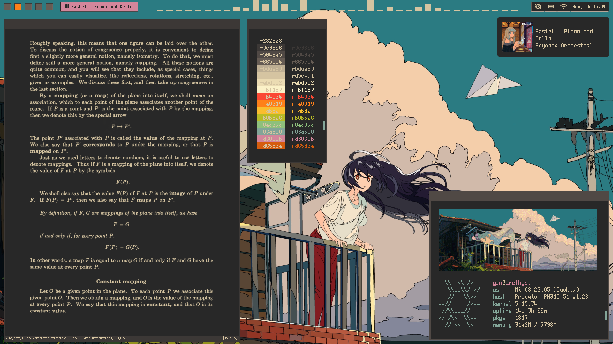

## welcome to this mess and stuff
i dont use nixos anymore, so this config might become outdated after a while so yeah
thansk <3

## Sway Rice

## shameless macos clone

|                     |                                                                           |
| ------------------- | ------------------------------------------------------------------------- |
| OS                  | NixOS 23.05                                                               |
| Window Manager      | Sway / i3-gaps                                                            |
| Desktop Environment | Gnome                                                                     |
| GTK Theme           | Adwaita                                                  |
| Icon Theme          | Adwaita                                              |
| Cusor Theme         | Capitaine-cursors-white                                         |
| UI Font             | Inter                                          |
| Terminal            | Foot / Alacritty / Blackbox                                               |
| Terminal Font       | Iosevka                                          |
| PDF Viewer          | Zathura / Evince                                                          |
| Editor              | Neovim / Helix                                                            |
| Shell               | Zsh                                                                       |
| Wallpaper           | [Wallpaper](./assets/wallpaper.png)                                       |
| Colorscheme         | Horizon Dark                                                |

## Color Palette
|                    Colorscheme                       |              Horizon Dark               |
|:----------------------------------------------------:|:-----------------------------------------------------:|
| $$\textcolor{#1C1E26}{\text{████}}$$ `#1C1E26` |  $$\textcolor{#E93C58}{\text{████}}$$ `#E93C58` |
| $$\textcolor{#232530}{\text{████}}$$ `#232530` |  $$\textcolor{#E58D7D}{\text{████}}$$ `#E58D7D` |
| $$\textcolor{#2E303E}{\text{████}}$$ `#2E303E` |  $$\textcolor{#EFB993}{\text{████}}$$ `#EFB993` |
| $$\textcolor{#6F6F70}{\text{████}}$$ `#6F6F70` |  $$\textcolor{#EFAF8E}{\text{████}}$$ `#EFAF8E` |
| $$\textcolor{#9DA0A2}{\text{████}}$$ `#9DA0A2` |  $$\textcolor{#24A8B4}{\text{████}}$$ `#24A8B4` |
| $$\textcolor{#CBCED0}{\text{████}}$$ `#CBCED0` |  $$\textcolor{#DF5273}{\text{████}}$$ `#DF5273` |
| $$\textcolor{#DCDFE4}{\text{████}}$$ `#DCDFE4` |  $$\textcolor{#B072D1}{\text{████}}$$ `#B072D1` |
| $$\textcolor{#E3E6EE}{\text{████}}$$ `#E3E6EE` |  $$\textcolor{#E4A382}{\text{████}}$$ `#E4A382` |

## Credits
- [gammons/base16-obsidian](https://github.com/gammons/base16-obsidian)
- [Misterio77/nix-colors](https://github.com/Misterio77/nix-colors)
- [Misterio77/nix-starter-config](https://github.com/Misterio77/nix-starter-config/blob/minimal/configuration.nix)
- [fortuneteller2k/nix-config](https://github.com/fortuneteller2k/nix-config)
- [legendofmiracles/dotnix](https://github.com/legendofmiracles/dotnix)
- [nuxshed/dotfiles](https://github.com/nuxshed/dotfiles)
- [viperML/dotfiles](https://github.com/viperML/dotfiles)
